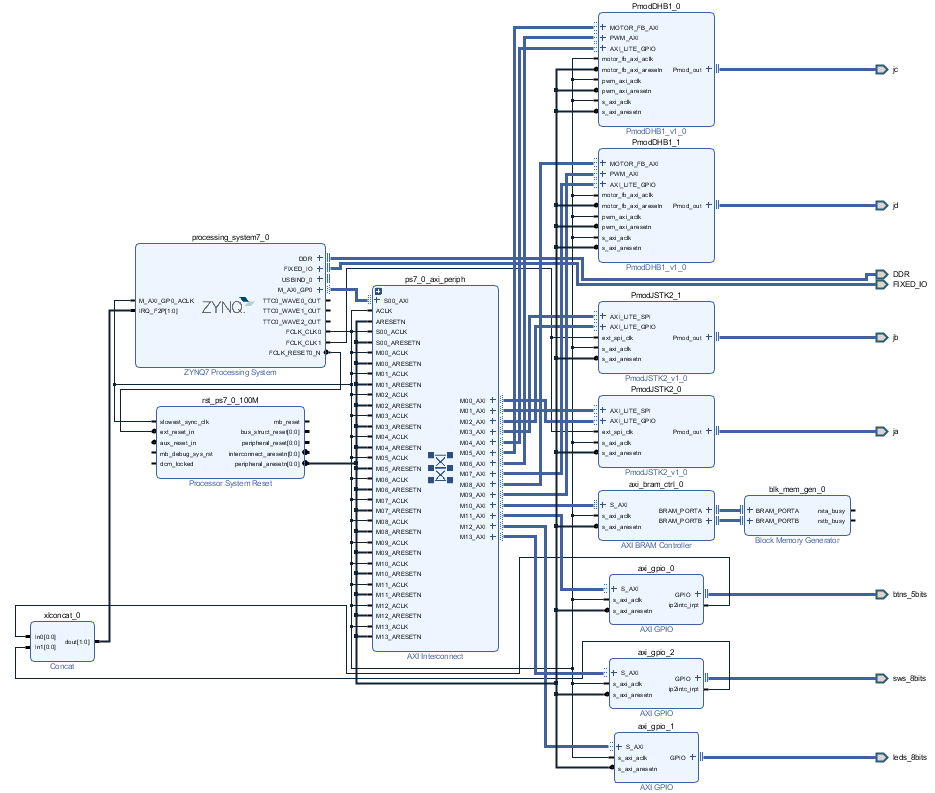

# Introduction
This repository includes the Vivado project files of robot car project for my ECE 520 class (System on Chip Design). It makes use of Vivado's IP Integrator feature.

**Note:**
- The C code can be viewed in `Robot_Control_main.c`.
- The files used for 3D printing the structure can be found in the `3D_Models_Print_Files` directory.
- For additional details, check out `ece520_final_project_report.pdf` for a detailed report of this project.

[Click here to watch a short video demonstration.](https://youtu.be/ALcJU5NfLdA)

# Description
Implemented using a Zedboard and written in C, this project involves Vivado's IP Integrator feature and allows interaction with the board's processor. Four DC motors with encoders are used,while a servo controls the attached gripper. For motion control, two Pmod Joysticks ([JSTK2](https://digilent.com/reference/pmod/pmodjstk2/start)) set the directions for the motors.

Moreover, in this design, interrupts are enabled for the push buttons in order to configure the speed of the DC motors.

The structure is mostly 3D printed using the [Original Prusa MINI+](https://shop.prusa3d.com/en/3d-printers/994-original-prusa-mini.html) Printer with PLA filament.

# Block Diagram

Top-Level Hierarchy:

# Zedbot

## Underside of the Zedbot

# Video Demonstration Links

Short Video Demonstration:

[Video Demonstration 1](https://youtu.be/ALcJU5NfLdA)

More about the code:

[Video Demonstration 2](https://youtu.be/0ILeQoVi7fs)
